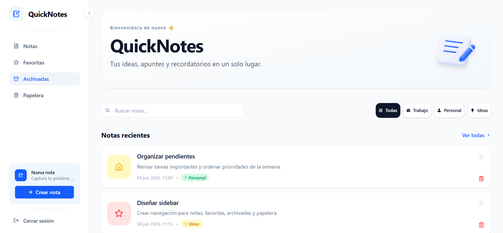

# QuickNotes

QuickNotes es una aplicación de notas construida con React, TypeScript, Vite y Tailwind CSS. El objetivo del proyecto es practicar conceptos fundamentales de React mientras se construye una interfaz limpia, modular y escalable.

## Vista previa



## Descripción

La aplicación permite crear notas con título, contenido, color, categoría e ícono. Las notas se muestran en tarjetas horizontales con ícono contextual, badge de categoría, favoritos y eliminación con confirmación. Incluye una sidebar colapsable en escritorio, una barra de navegación dock en móvil, búsqueda en tiempo real y filtros por categoría. Es instalable como PWA y persiste los datos en `localStorage`.

Este proyecto forma parte de una práctica progresiva para reforzar conceptos como:

- Componentes reutilizables y modularización por carpeta
- Props tipadas con TypeScript
- Context API con `SidebarContext` y `NotesContext`
- Hooks personalizados para separar lógica de UI
- Formularios controlados con validación
- Búsqueda con debounce usando `useEffect`
- Filtrado reactivo con `useMemo`
- Modales accesibles (Escape, focus trap, scroll lock)
- Sidebar colapsable con transición CSS animada
- Estilos con Tailwind CSS y objetos de estilos por componente

## Tecnologías utilizadas

- React 19
- TypeScript ~6.0
- Vite 8
- Tailwind CSS v4
- React Icons v5
- clsx
- vite-plugin-pwa
- Bun

## Instalación

```bash
bun install
```

## Ejecutar el proyecto

```bash
bun run dev
```

Después abre la URL que muestra la terminal, normalmente `http://localhost:5173`.

## Scripts disponibles

| Script                 | Descripción                                      |
| ---------------------- | ------------------------------------------------ |
| `bun run dev`          | Inicia el servidor de desarrollo.                |
| `bun run build`        | Genera la versión de producción.                 |
| `bun run preview`      | Previsualiza la versión de producción.           |
| `bun run format`       | Formatea los archivos del proyecto con Prettier. |
| `bun run format:check` | Revisa el formato sin modificar archivos.        |

## Estructura del proyecto

```txt
src/
├─ App/
│  ├─ components/
│  │  ├─ AppContent/
│  │  ├─ AppHeader/
│  │  └─ AppToolbar/
│  ├─ data/
│  │  └─ toolbar.data.ts
│  ├─ hooks/
│  │  ├─ useNoteModal.ts
│  │  └─ useNotesFilter.ts
│  ├─ App.tsx
│  └─ App.styles.ts
├─ components/
│  ├─ layout/
│  │  ├─ MobileNav/
│  │  └─ Sidebar/
│  │     ├─ components/
│  │     │  ├─ SidebarBrand/
│  │     │  ├─ SidebarContent/
│  │     │  ├─ SidebarFooter/
│  │     │  ├─ SidebarItem/
│  │     │  ├─ SidebarNav/
│  │     │  ├─ SidebarQuickAction/
│  │     │  └─ SidebarToggle/
│  │     ├─ context/
│  │     │  ├─ SidebarContext.ts
│  │     │  ├─ SidebarProvider.tsx
│  │     │  └─ useSidebarContext.ts
│  │     └─ data/
│  ├─ notes/
│  │  ├─ NoteCard/
│  │  ├─ NoteForm/
│  │  │  └─ hooks/
│  │  │     └─ useNoteForm.ts
│  │  └─ NoteList/
│  └─ ui/
│     ├─ Button/
│     ├─ ConfirmDialog/
│     ├─ FormField/
│     ├─ Input/
│     ├─ Modal/
│     │  └─ hooks/
│     └─ Textarea/
├─ constants/
├─ context/
│  └─ notes/
│     ├─ NotesContext.ts
│     ├─ NotesProvider.tsx
│     └─ useNotes.ts
├─ data/
│  ├─ noteIcons.data.ts
│  └─ notes.data.ts
├─ types/
│  └─ note.types.ts
├─ utils/
│  ├─ createNote.utils.ts
│  └─ formatDate.utils.ts
└─ main.tsx
```

## Modelo de datos

```ts
export type NoteColor =
  | 'blue'
  | 'green'
  | 'yellow'
  | 'pink'
  | 'purple'
  | 'red'
  | 'orange';
export type NoteCategory = 'work' | 'personal' | 'ideas';
export type NoteFilter = 'all' | NoteCategory;
export type NoteIcon =
  | 'book'
  | 'lightbulb'
  | 'briefcase'
  | 'code'
  | 'heart'
  | 'star'
  | 'flag'
  | 'music'
  | 'home'
  | 'shopping';

export interface Note {
  id: string;
  title: string;
  content: string;
  createdAt: string;
  updatedAt: string;
  color?: NoteColor;
  category?: NoteCategory;
  icon?: NoteIcon;
}
```

### Campos

| Campo       | Tipo           | Descripción                                                           |
| ----------- | -------------- | --------------------------------------------------------------------- |
| `id`        | `string`       | Identificador único generado con `crypto.randomUUID()`.               |
| `title`     | `string`       | Título breve de la nota.                                              |
| `content`   | `string`       | Contenido principal de la nota.                                       |
| `createdAt` | `string`       | Fecha de creación en formato ISO.                                     |
| `updatedAt` | `string`       | Fecha de última edición en formato ISO.                               |
| `color`     | `NoteColor`    | Color opcional para personalizar la tarjeta (7 opciones).             |
| `category`  | `NoteCategory` | Categoría opcional: trabajo, personal o ideas.                        |
| `icon`      | `NoteIcon`     | Ícono opcional para el encabezado visual de la tarjeta (10 opciones). |

## Componentes principales

### `MobileNav`

Barra de navegación tipo dock visible solo en móvil. Contiene los ítems de navegación a izquierda y derecha con un botón central flotante para crear una nota nueva. Comparte los ítems de navegación con `Sidebar` vía `SIDEBAR_ITEMS`.

### `Sidebar`

Sidebar colapsable con ancho animado (`w-60` expandido, `w-20` colapsado). Contiene:

- `SidebarBrand` — logo y nombre de la app
- `SidebarNav` — lista de items de navegación con estado activo
- `SidebarToggle` — botón flotante para colapsar/expandir
- `SidebarFooter` — quick action para nueva nota + botón de cerrar sesión

El estado colapsado se gestiona con `SidebarContext` y está disponible en todos los subcomponentes vía `useSidebar`.

### `AppToolbar`

Barra de herramientas con:

- Input de búsqueda con debounce de 500 ms
- Botones de filtro por categoría (`Todas`, `Trabajo`, `Personal`, `Ideas`) usando la variante `selected`/`secondary` del componente `Button`

### `NoteCard`

Tarjeta horizontal con:

- Caja de ícono a la izquierda, coloreada según `note.color` (fallback a `LuFileText`)
- Título, contenido truncado y fecha de creación formateada
- Badge de categoría con ícono (trabajo / personal / ideas)
- Botón de favorito (estado local por tarjeta, persistencia pendiente)
- Botón de eliminar que dispara `ConfirmDialog` vía `NotesContext`

### `NoteForm`

Formulario controlado para crear notas. Incluye título, contenido, selector de color, selector de ícono y selector de categoría con toggle (clic en la misma categoría la deselecciona).

### `ConfirmDialog`

Diálogo de confirmación reutilizable con variante `danger`. Se usa al eliminar notas y recibe callbacks `onConfirm` / `onCancel`. Se renderiza dentro de `AppContent` y su estado lo gestiona `NotesContext`.

### `Modal`

Modal accesible con cierre por Escape (`useEscapeKey`), bloqueo de scroll (`useLockScroll`) y trampa de foco (`useFocusTrap`). Se renderiza con `createPortal`.

### `Button`

Componente reutilizable con variantes `primary`, `secondary`, `selected`, `unstyled`; tamaños `sm`, `md`, `lg`; y opción de ancho completo.

## Hooks personalizados

| Hook             | Descripción                                                                |
| ---------------- | -------------------------------------------------------------------------- |
| `useNoteModal`   | Estado del modal de nueva nota: `isOpen`, `open`, `close`, `handleSubmit`. |
| `useNotesFilter` | Búsqueda con debounce y filtro por categoría. Retorna `filteredNotes`.     |
| `useNoteForm`    | Estado del formulario, validación y reset.                                 |
| `useSidebar`     | Accede a `isCollapsed` y `toggleSidebar` desde cualquier componente.       |
| `useEscapeKey`   | Dispara un callback al presionar Escape.                                   |
| `useFocusTrap`   | Aplica `inert` al `#root` mientras el modal está abierto.                  |
| `useLockScroll`  | Bloquea el scroll del body mientras el modal está abierto.                 |

## Utilidades

### `createNote`

Factory que construye un `Note` completo a partir de un `NoteInput`, generando `id` con `crypto.randomUUID()` y timestamps con `new Date().toISOString()`.

### `formatDate`

Convierte una fecha ISO a un formato legible en español (es-MX).

```ts
formatDate('2026-06-04T10:30:00.000Z');
// → "04 jun 2026, 10:30"
```

## Decisiones técnicas

### Context API para notas y sidebar

Se usa `NotesContext` para compartir el estado de notas sin prop drilling, y `SidebarContext` para que todos los subcomponentes de la sidebar accedan al estado colapsado sin recibir props manualmente.

### Debounce manual en búsqueda

El debounce se implementa con `useEffect` + `setTimeout` + `clearTimeout` en lugar de una librería externa, para practicar el patrón directamente.

### Estilos como objetos separados

Cada componente tiene su archivo `.styles.ts` con un objeto de clases de Tailwind. Esto mantiene el JSX limpio y centraliza los ajustes visuales por componente.

### Fechas como `string`

Las fechas se guardan en formato ISO porque en el futuro se usará `localStorage`, que serializa todo como texto.

## Estado actual

- Tarjetas horizontales con ícono, color, categoría y badge.
- Creación de notas desde un modal accesible (sidebar en escritorio, dock en móvil).
- Eliminación de notas con diálogo de confirmación.
- Marcado de notas como favoritas con estado local por tarjeta (persistencia pendiente).
- Búsqueda en tiempo real con debounce.
- Filtros por categoría.
- Sidebar colapsable con transición animada (escritorio).
- Barra de navegación dock en móvil (`MobileNav`).
- Persistencia de notas en `localStorage`.
- Instalable como PWA.

> Actualmente el proyecto se encuentra en una versión inicial funcional, enfocada en practicar React, TypeScript, componentes reutilizables, manejo de estado y persistencia local.

## Próximas mejoras

- Permitir la edición de notas existentes.
- Persistir notas favoritas en localStorage.
- Implementar la funcionalidad completa de la sidebar, incluyendo las secciones de notas, favoritas, archivadas y papelera.
- Agregar soporte para modo oscuro.
- Evaluar la implementación de autenticación de usuario y cierre de sesión.

## Autor

**Juan Antonio Aguirre Mares**  
Estudiante de Ingeniería en Informática.

Este proyecto fue desarrollado como parte de mi proceso de aprendizaje en Desarrollo Web, con el objetivo de practicar la creación de componentes, manejo de estado, filtrado de datos y estructura modular de una aplicación web.

## Herramientas de apoyo

Durante el desarrollo utilicé herramientas de apoyo como Claude Code y ChatGPT para orientación, depuración y mejora de código.

La implementación fue revisada, adaptada y comprendida manualmente, aplicando conocimientos previamente adquiridos como estudiante de Ingeniería en Informática.
